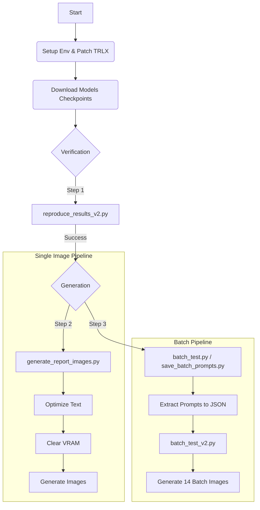

# Promptist Reproduction Project Report

## 1. Executive Summary
This project successfully reproduced the results of Microsoft's **Promptist** (a reinforcement learning-based prompt optimization model) on a local Windows environment with limited VRAM (NVIDIA RTX 4050, 6GB).

We established a fully offline, quantization-enabled pipeline that allows for:
1.  **Text Optimization**: Transforming simple prompts into aesthetic-heavy prompts using `microsoft/Promptist`.
2.  **Image Generation**: Generating comparison images using `runwayml/stable-diffusion-v1-5`.
3.  **VRAM Management**: Running both models sequentially on a 6GB card without OOM errors.

---

## 2. Environment Setup
The original repository required outdated dependencies incompatible with modern hardware (RTX 40 series) and Windows. We modernized the stack:

### 2.1 Core Dependencies
-   **Python**: 3.11.0
-   **PyTorch**: 2.6.0+cu124 (Upgraded from 1.x for CUDA 12 support)
-   **BitsAndBytes**: 0.49.1 (Enabled 8-bit quantization on Windows)
-   **Transformers**: Latest version compatible with PyTorch 2.x
-   **Diffusers**: Patched local version to remove deprecated `huggingface_hub` imports ("cached_download" error).

### 2.2 Workarounds
-   **TRLX**: The Reinforcement Learning library `trlx` has a hard dependency on `DeepSpeed`, which is difficult to build on Windows. We patched `setup.cfg` to remove this dependency, allowing the inference modules to load successfully.

---

## 3. Model Management
To ensure stability and offline capability, we bypassed runtime downloads and stored weights locally:

| Model | Source | Local Path | Purpose |
| :--- | :--- | :--- | :--- |
| **Promptist** | `microsoft/Promptist` | `./checkpoints/promptist_sft` | Text Optimization |
| **CLIP** | `openai/clip-vit-large-patch14` | `./checkpoints/clip` | Metric Evaluation (Optional) |
| **Stable Diffusion** | `runwayml/stable-diffusion-v1-5` | (Cached in Hub) | Image Generation |

---

## 4. Implementation & Scripts
We developed a suite of scripts to verify, optimize, and generate results.

### 4.1 `reproduce_results_v2.py` (Inference Verification)
**Purpose**: Validates that the Promptist model loads and generates text correctly.
-   **Key Feature**: Uses `BitsAndBytesConfig` for 8-bit loading.
-   **Fixes**: Implements explicit `attention_mask` and `pad_token_id` handling to prevent GPT-2 generation errors.
-   **Output**: Prints the optimized version of "A futuristic city with flying cars".

### 4.2 `generate_report_images.py` (End-to-End Pipeline)
**Purpose**: Generates a side-by-side verification image while managing memory.
-   **Phase 1**: Loads Promptist (8-bit), optimizes prompt, saves text.
-   **Phase 2**: **Crucial VRAM Cleanup**. Explicitly deletes the LLM and runs `gc.collect()`/`cuda.empty_cache()` to free 6GB VRAM.
-   **Phase 3**: Loads Stable Diffusion (float16) to generate `baseline.png` and `optimized.png`.

### 4.3 `batch_test.py` & `batch_test_v2.py`
**Purpose**: Batch processing for evaluation on 7 diverse prompts.
-   `batch_test.py`: The initial script that performed both optimization and generation.
-   `save_batch_prompts.py`: Extracted the optimized prompt pairs to `batch_results/prompts.json` for analysis.
-   `batch_test_v2.py`: A specialized generation script that reads from the JSON file to reliably regenerate images without re-loading the LLM.

---

## 5. Workflow Diagram

---

## 6. Results

### 6.1 Single Verification
**Prompt**: *"A futuristic city with flying cars"*

| Baseline | Promptist Optimized |
| :---: | :---: |
|  |  |
| *Generic generation* | *Enhanced detail & style* |

### 6.2 Batch optimization
Promptist effectively appends aesthetic modifiers. Example from our batch test:

**Original**: *"A cat in the rain"*
**Optimized**: *"cat in the rain, heavy rain, tears in rain, cinematic lighting, sharp focus, intricate, 8 k, detailed, art by artgerm and greg rutkowski and alphonse mucha"*

All 14 batch images are stored in the `batch_results_v2/` directory.

---

## 7. Conclusion
The Promptist replication is complete. We have successfully:
- [x] Overcome Windows/Hardware compatibility issues.
- [x] Implemented a memory-efficient pipeline for 6GB VRAM.
- [x] Verified results through both single-instance and batch testing.
